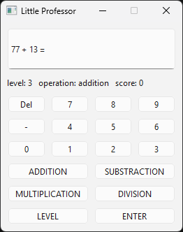

# 🧠 Little Professor (Desktop App)

A desktop math training application inspired by the classic **Little Professor** calculator.  
The application generates arithmetic problems and challenges the user to solve them under limited attempts.  
Built with **Python + PyQt6**, following a modular architecture and tested with **pytest**.

---

## 🚀 Features

- Generate random math expressions:
  - Addition
  - Subtraction
  - Multiplication
  - Division (no division by zero, always integer results)
- 5 difficulty levels (controls number size)
- Interactive GUI (desktop application)
- Score tracking system
- 3 attempts per question
- Automatic feedback:
  - ❌ Incorrect → `EEE`
  - ✅ Correct → next problem
- End-of-round score summary

---

## 🖼 Application Preview



---

## 🧱 Architecture

The project follows a clean separation of concerns:  
```text
Little-Professor/
│
├── main.py                     # Entry point
│
├── gui/
│   ├── view.py                 # UI (LPView)
│   ├── controller.py           # App logic & event handling (LPController)
│   └── __init__.py
│
├── logic/
│   ├── game.py                 # Core math logic (pure functions)
│   └── __init__.py
│
├── tests/
│   ├── test_game.py            # Unit tests (pytest)
│   └── __init__.py
│
├── .gitignore
├── requirements.txt
└── README.md
```

---

## ⚡ Quick Start

```bash
git clone https://github.com/serhiintus/Little-Professor.git
cd Little-Professor
pip install -r requirements.txt
python main.py
```

---

## ⚙️ Optional: Virtual Environment (Recommended)

```bash
python -m venv venv
venv/Scripts/activate   # Windows
pip install -r requirements.txt
```

---

## 📦 Download (No Python required)

👉 **[Download Little-Professor.exe](https://github.com/serhiintus/Little-Professor/releases/tag/v1.0.0)**

Run the application by double-clicking the file.

---

## 🧪 Run tests

```bash
pytest
```

---

## 🧠 Technical Highlights

- Modular architecture (gui / logic separation)
- MVC-like design (View + Controller)
- Pure functions for business logic (easy to test)
- Deterministic and logic-based unit testing
- Clean dependency management

---

## 🎥 Demo

<https://youtu.be/cz2NqjpCpZs>

---

## ⭐ Why this project?

This project highlights:

- Ability to design and structure a real-world application
- Experience with GUI development using PyQt6
- Writing clean, modular, and testable Python code
- Applying software architecture principles (separation of concerns)
- Delivering a complete product (code + executable + documentation)


---

## 🛠 Tech Stack

- Python
- PyQt6
- PyInstaller
- pytest

---

## 👨‍💻 Author

**Serhii Provotorov**

LinkedIn: https://www.linkedin.com/in/serhii-provotorov-5b621b1b1/

